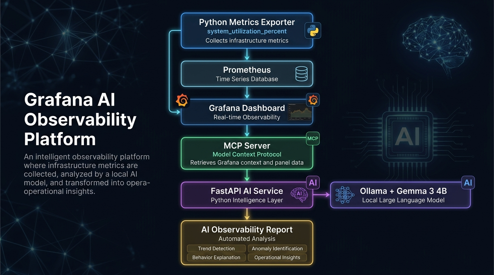
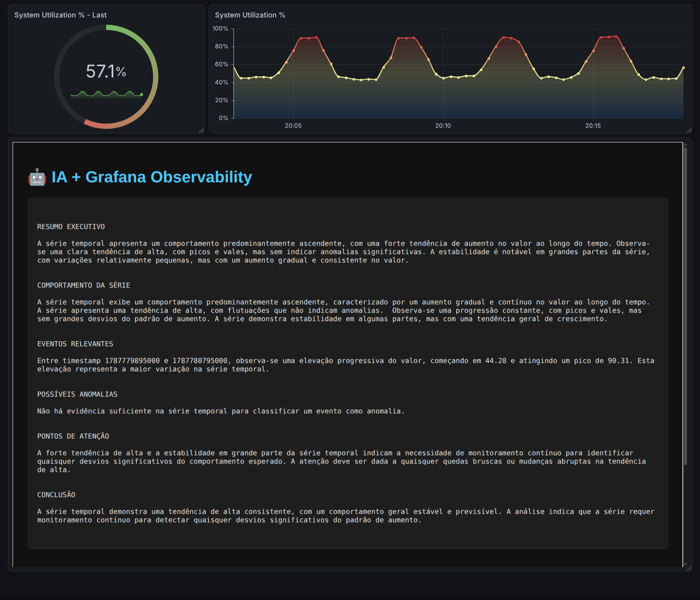
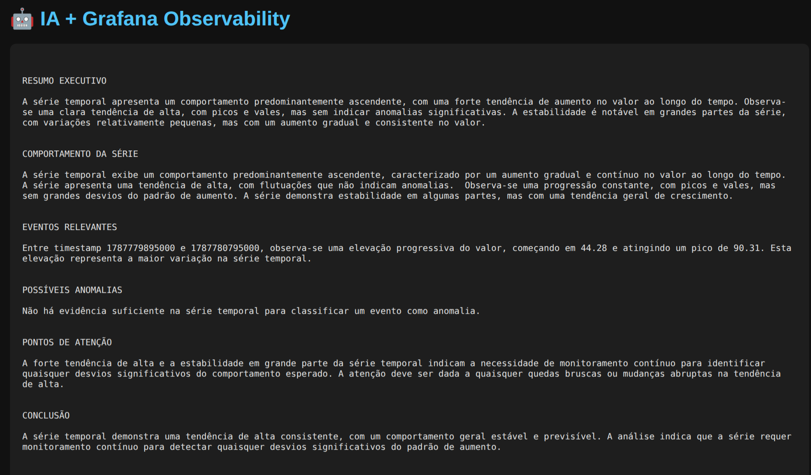

# Grafana AI Observability


> A local-first intelligent observability proof of concept combining Grafana, Prometheus, Python, MCP, SQLite, Ollama and Gemma 3 4B.
>
> ## 🚀 Project Highlights

- 🤖 **Local AI analysis** using Ollama + Gemma 3 4B without external AI APIs
- 🔎 **Context-aware observability** through Grafana + MCP integration
- 📊 **Time-series interpretation** instead of simple metric visualization
- 🧠 **AIOps foundation** for intelligent monitoring workflows
- 🔒 **Local-first architecture** focused on privacy and control
- 🐍 **Python-based AI orchestration** connecting metrics, context and LLM reasoning

---


---

## Architecture



---

# ⭐ Featured AI Engineering Project

## Grafana AI Observability Platform

An end-to-end AIOps proof of concept that combines:

- 📊 Real-time observability with Grafana and Prometheus
- 🐍 Python-based data collection and analysis
- 🔌 Model Context Protocol (MCP) integration
- 🤖 Local Large Language Model inference using Ollama + Gemma 3 4B
- 🧠 AI-generated operational insights from real monitoring data

This project demonstrates how traditional observability platforms can evolve into intelligent systems capable of interpreting infrastructure behavior.

The AI does not receive artificial examples. It retrieves real dashboard context, analyzes time-series data, identifies patterns and generates operational reports.

Key concepts demonstrated:

✅ AI Engineering  
✅ AIOps  
✅ Observability Intelligence  
✅ Local LLM deployment  
✅ MCP-based AI integrations  
✅ Time-series analysis  
✅ Infrastructure analytics

---

## 🚀 Demo Flow

The platform follows this end-to-end flow:

**1. Metrics Collection**  
Python Exporter generates infrastructure utilization metrics.

⬇️

**2. Prometheus**  
Prometheus collects and stores the time-series metrics.

⬇️

**3. Grafana**  
Grafana visualizes the metrics through a real-time dashboard.

⬇️

**4. MCP Context Retrieval**  
The MCP Server retrieves the real dashboard and panel data from Grafana.

⬇️

**5. AI Analysis**  
The Python AI service sends the time-series data to the local Ollama / Gemma 3 4B model.

⬇️

**6. Observability Report**  
The AI interprets the behavior of the time series and generates an operational report.

### In short

```text
Infrastructure Metrics
        ↓
Python Exporter
        ↓
Prometheus
        ↓
Grafana
        ↓
MCP Server
        ↓
AI API
        ↓
Ollama + Gemma 3 4B
        ↓
AI Observability Report

---

[🇧🇷 Português](#português) | [🇺🇸 English](#english)
---
## Português

### Visão geral

O **Grafana AI Observability** é uma Proof of Concept (PoC) de observabilidade assistida por IA local. Ele coleta uma métrica de utilização simulada, armazena e exibe sua série temporal e permite que uma IA consulte dados reais de um painel Grafana através do **Model Context Protocol (MCP)**.

A pergunta central é: **“IA, analise esta série temporal e explique o que está acontecendo.”**

O projeto separa responsabilidades: Prometheus coleta métricas, Grafana as visualiza, o MCP obtém o contexto do painel, e o Ollama executa o Gemma 3 4B localmente para gerar um relatório. Scripts auxiliares persistem dados no SQLite e detectam eventos anômalos.

### Objetivo técnico

Demonstrar um fluxo completo em que o modelo recebe uma série temporal obtida do Grafana — e não dados inventados — para interpretar estabilidade, oscilações, ciclos, picos, quedas, mudanças de comportamento e possíveis anomalias. A análise deve diferenciar observações baseadas nos dados de hipóteses operacionais.

### Arquitetura

```text
┌──────────────────────────────┐
│ Metrics Exporter (Python)    │
│ system_utilization_percent   │
└───────────────┬──────────────┘
                │ /metrics :8000
                ▼
┌──────────────────────────────┐
│ Prometheus                   │
│ scrape a cada 5 segundos     │
└───────┬──────────────┬───────┘
        │              │
        │              └──────► SQLite + detector de anomalias
        ▼
┌──────────────────────────────┐
│ Grafana                      │
│ dashboards e painéis         │
└───────────────┬──────────────┘
                │ Grafana HTTP API
                ▼
┌──────────────────────────────┐
│ MCP Server (FastMCP/Python)  │
│ get_panel_data               │
└───────────────┬──────────────┘
                │ stdio / MCP
                ▼
┌──────────────────────────────┐
│ AI API (Python, :8001)       │
│ extrai a série do painel     │
└───────────────┬──────────────┘
                │ dados reais + prompt
                ▼
┌──────────────────────────────┐
│ Ollama local / Gemma 3 4B    │
└───────────────┬──────────────┘
                ▼
┌──────────────────────────────┐
│ Relatório de observabilidade │
└──────────────────────────────┘
```

### Fluxo de dados

1. `exporter/server.py` publica `system_utilization_percent` em `/metrics`.
2. O Prometheus coleta a métrica a cada 5 segundos.
3. O Grafana consulta Prometheus e exibe a série em um painel **Time series**.
4. A API de IA inicia um cliente MCP por `stdio`.
5. O MCP lê a configuração do dashboard, encontra o painel e executa a query pela API do Grafana.
6. A API extrai pares `timestamp`/`value` e os envia ao Ollama.
7. O Gemma 3 4B produz o relatório em português, salvo em `collector/latest_report.json` e disponível também em HTML.

### Tecnologias

| Tecnologia | Papel |
| --- | --- |
| Python 3.12+ | Exportador, MCP, coleta, análise e API |
| Docker Compose | Grafana, Prometheus e exportador |
| Prometheus | Coleta e séries temporais |
| Grafana | Dashboards e execução de queries |
| FastMCP / MCP | Acesso controlado ao contexto do Grafana |
| SQLite | Persistência local de amostras e eventos |
| Ollama + Gemma 3 4B | Inferência e análise local |

### Estrutura de diretórios

```text
grafana-ai/
├── collector/
│   ├── ai_api.py              # API HTTP de relatórios
│   ├── ai_report.py           # Cliente MCP, extração e prompt
│   ├── anomaly_detector.py    # Eventos por limiar e salto
│   ├── analyze.py             # Estatísticas locais básicas
│   ├── collector.py           # Persiste consulta Prometheus no SQLite
│   ├── database.py            # Cria a tabela metrics
│   ├── ollama_analysis.py     # Fluxo alternativo de resumo + LLM
│   ├── plot_metrics.py        # Gráfico local de métricas
│   └── prometheus_client.py   # Cliente da API Prometheus
├── exporter/
│   ├── Dockerfile
│   └── server.py              # Exportador da métrica simulada
├── prometheus/prometheus.yml  # Configuração de scrape
├── .env.example               # Modelo de configuração
├── docker-compose.yml
├── mcp_client_test.py         # Teste da integração MCP
├── mcp_server.py              # Ferramenta get_panel_data
└── requirements.txt
```

### Pré-requisitos

- Docker Engine com Docker Compose v2;
- Python 3.12 ou posterior;
- Ollama instalado e em execução localmente;
- token de serviço do Grafana com privilégios mínimos para ler o dashboard e consultar a datasource.

### Configuração

No diretório do projeto:

```bash
python3 -m venv .venv
source .venv/bin/activate
pip install -r requirements.txt
cp .env.example .env
ollama pull gemma3:4b
```

Preencha `.env` com dados do seu ambiente, nunca com valores de exemplo em produção:

```dotenv
GRAFANA_URL=http://localhost:3000
GRAFANA_TOKEN=cole_um_token_de_servico_aqui
DASHBOARD_UID=uid_do_seu_dashboard
PANEL_ID=1
OLLAMA_URL=http://localhost:11434/api/generate
OLLAMA_MODEL=gemma3:4b
OLLAMA_CONTEXT=8192
OLLAMA_TEMPERATURE=0.1
```

Antes de iniciar os scripts, carregue as variáveis no mesmo shell:

```bash
set -a
source .env
set +a
```

### Execução

Inicie a camada de observabilidade:

```bash
docker compose up --build -d
```

| Serviço | URL |
| --- | --- |
| Grafana | http://localhost:3000 |
| Prometheus | http://localhost:9090 |
| Exportador | http://localhost:8000/metrics |

No Grafana, use `http://prometheus:9090` como URL da datasource (dentro do Compose). Crie um painel **Time series** com:

```promql
system_utilization_percent
```

Configure o UID e ID do painel no `.env`, teste o MCP e inicie a API:

```bash
python mcp_client_test.py
python collector/ai_api.py
```

### Endpoints da API

A API escuta na porta `8001`.

| Método | Endpoint | Descrição |
| --- | --- | --- |
| GET | `/` | Metadados do serviço |
| GET | `/health` | Verificação de saúde |
| GET | `/api/ai-report` | Consulta Grafana via MCP e gera novo relatório |
| GET | `/api/ai-report-latest` | Retorna o relatório salvo sem executar a IA |
| GET | `/api/ai-report-html` | Retorna o relatório em HTML para uso no Grafana |

```bash
curl http://localhost:8001/health
curl http://localhost:8001/api/ai-report
curl http://localhost:8001/api/ai-report-latest
```

`/api/ai-report` pode levar mais tempo porque consulta o Grafana e aguarda inferência local. Chame-o ao menos uma vez antes de usar os endpoints `-latest` ou `-html`.

### MCP e Grafana

O `mcp_server.py` expõe `get_panel_data(dashboard_uid, panel_id)`. A ferramenta lê o dashboard, localiza o painel, valida que ele é do tipo `timeseries`, reutiliza datasource e queries configuradas e chama `/api/ds/query` no Grafana. A resposta inclui metadados e os frames brutos do painel.

O MCP é iniciado pela aplicação via `stdio`; nenhuma porta MCP é exposta. O token de serviço do Grafana é obrigatório e deve ter apenas os privilégios necessários.

### SQLite e detecção de anomalias

Para persistir dez minutos de dados do Prometheus e processá-los localmente:

```bash
python collector/database.py
python collector/collector.py
python collector/analyze.py
python collector/anomaly_detector.py
```

O detector agrupa pontos próximos em eventos e considera anômalo um valor `>= 85` ou uma variação absoluta entre amostras `>= 8`. A severidade usa o salto inicial e o pico, podendo ser `MODERADA`, `ALTA` ou `CRÍTICA`. São limiares demonstrativos: ajuste-os à métrica, sazonalidade e SLOs do ambiente real.

### Segurança e segredos

- Nunca versione `.env`, tokens, bancos SQLite ou relatórios gerados.
- Use token de serviço do Grafana com escopo mínimo e faça rotação regular.
- Restrinja as portas `3000`, `8001` e `11434` a redes confiáveis; não as exponha publicamente sem autenticação adicional.
- Revise métricas e labels antes de enviá-los ao modelo: até uma IA local pode receber contexto sensível.
- Não inclua segredos em logs, exemplos, issues ou capturas de tela.

### Troubleshooting básico

| Sintoma | Verificação / solução |
| --- | --- |
| Sem dados no Prometheus | Abra `http://localhost:8000/metrics`, rode `docker compose ps` e consulte `http://localhost:9090/targets`. |
| Painel vazio no Grafana | Confira datasource, query e intervalo de tempo do painel. |
| `GRAFANA_TOKEN não está configurado` | Carregue `.env` no shell que inicia o teste MCP ou a API. |
| Painel não encontrado / tipo inválido | Valide `DASHBOARD_UID`, `PANEL_ID` e o tipo **Time series**. |
| Erro de Ollama | Confirme que o serviço está ativo e que `ollama list` mostra `gemma3:4b`. |
| Erro de importação Python | Ative `.venv` e execute `pip install -r requirements.txt`. |

### Próximos passos

- Substituir o exportador simulado por métricas reais.
- Parametrizar URLs, query, limites e banco por ambiente.
- Proteger a API de IA com autenticação e rate limiting.
- Agendar coleta, retenção e deduplicação no SQLite.
- Combinar limiares com baseline sazonal e alertas do Prometheus.
- Adicionar metadados, feedback do operador e testes automatizados.

---

## Screenshots

### Grafana Dashboard



### AI Generated Observability Report




---

## English

### Overview

**Grafana AI Observability** is a local-first proof of concept for contextual observability analysis. It collects a simulated utilization metric, stores and visualizes its time series, and lets an AI retrieve real Grafana panel data through the **Model Context Protocol (MCP)**.

The pipeline is deliberately separated: Python exporter → Prometheus → Grafana Time series panel → FastMCP server → Python AI API → local Ollama / Gemma 3 4B → observability report. SQLite scripts provide local persistence and deterministic anomaly-event detection.

### Goal and components

The model receives a time series retrieved from Grafana, not fabricated values. It is asked to inspect the full chronological sequence and discuss stability, oscillations, cycles, peaks, drops, regime changes, and observations worth investigating without inventing causes.

| Component | Responsibility |
| --- | --- |
| Python exporter | Publishes `system_utilization_percent` on port 8000 |
| Prometheus | Scrapes every 5 seconds and stores time series |
| Grafana | Dashboard visualization and query execution |
| FastMCP server | Exposes `get_panel_data` over stdio |
| Python AI API | Generates and serves reports on port 8001 |
| Ollama / Gemma 3 4B | Local LLM inference |

### Setup and execution

Install Docker Compose, Python 3.12+, and Ollama. Create `.env` from `.env.example`, set the Grafana URL, a least-privilege Grafana service token, dashboard UID, panel ID, and Ollama settings. Never commit that file.

```bash
python3 -m venv .venv
source .venv/bin/activate
pip install -r requirements.txt
cp .env.example .env
ollama pull gemma3:4b
set -a && source .env && set +a
docker compose up --build -d
python mcp_client_test.py
python collector/ai_api.py
```

Create a Grafana **Time series** panel using the Prometheus query:

```promql
system_utilization_percent
```

### API and MCP

| Endpoint | Purpose |
| --- | --- |
| `GET /` | Service metadata |
| `GET /health` | Health check |
| `GET /api/ai-report` | Fetches Grafana panel data through MCP and generates a report |
| `GET /api/ai-report-latest` | Returns the cached report |
| `GET /api/ai-report-html` | Returns the cached report as HTML |

`get_panel_data(dashboard_uid, panel_id)` reads the dashboard definition, checks that the panel is a time-series panel, reuses its datasource and queries, calls Grafana’s query API, and returns raw panel frames plus metadata. MCP uses `stdio`; it does not open a network port.

### Anomaly detection, security, and troubleshooting

Run `database.py`, `collector.py`, and `anomaly_detector.py` for local persistence and event detection. The sample detector flags values at least 85 and point-to-point changes at least 8; tune these demonstration thresholds to real metrics and SLOs.

Keep Grafana tokens, databases, generated reports, and `.env` out of version control. Restrict Grafana, AI API, and Ollama network access, use least-privilege tokens, rotate them, and inspect labels before sending contextual data to any model.

- **No metrics:** check `/metrics`, `docker compose ps`, and Prometheus targets.
- **Empty panel:** verify datasource, PromQL query, and selected time range.
- **Missing token:** load `.env` in the shell that starts the MCP client or API.
- **Ollama error:** make sure Ollama is running and `ollama list` includes `gemma3:4b`.
- **No cached report:** call `/api/ai-report` before the latest or HTML endpoint.

### Next steps

Replace the simulated exporter with production metrics, externalize all operational configuration, authenticate and rate-limit the AI API, add scheduled collection and retention, use adaptive baselines and Prometheus alerts, preserve report metadata and feedback, and add automated tests.

---

## Screenshots

### Grafana Dashboard


### AI Generated Observability Report


AI Generated Observability Report to English

EXECUTIVE SUMMARY
The time series shows a predominantly upward pattern, with a strong increasing trend in value over time. There is a clear upward trend, with peaks and troughs, but no significant anomalies. Stability is noticeable across large portions of the series, with relatively small variations alongside a gradual and consistent increase in value.

SERIES BEHAVIOR
The time series exhibits a predominantly upward pattern, characterized by a gradual and continuous increase in value over time.
The series shows an upward trend, with fluctuations that do not indicate anomalies.
A steady progression is observed, with peaks and troughs but no major deviations from the increasing pattern. The series demonstrates stability in some parts, while maintaining an overall growth trend.

RELEVANT EVENTS
Between timestamps 1787779895000 and 1787780795000, a progressive increase in value is observed, starting at 44.28 and reaching a peak of 90.31. This increase represents the largest variation in the time series.

POSSIBLE ANOMALIES
There is insufficient evidence in the time series to classify any event as an anomaly.

POINTS OF ATTENTION
The strong upward trend and stability throughout much of the time series indicate the need for continuous monitoring to identify any significant deviations from expected behavior. Attention should be given to any sharp declines or abrupt changes in the upward trend.

CONCLUSION
The time series demonstrates a consistent upward trend, with generally stable and predictable behavior. The analysis indicates that the series requires continuous monitoring to detect any significant deviations from the increasing pattern.

---

## License

This project is a Proof of Concept. Add the license appropriate to your intended distribution before publishing it.
